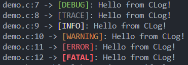

# CLog
CLog is a simple header-only logging library for C and C++.

# Usage
CLog uses a basic macro for logging, and an enum for the different levels of logging
```C
#include "clog.h"

int main(void) {
    clog(CLOG_DEBUG,   "Hello from CLog!\n");
    clog(CLOG_TRACE,   "Hello from CLog!\n");
    clog(CLOG_INFO,    "Hello from CLog!\n");
    clog(CLOG_WARNING, "Hello from CLog!\n");
    clog(CLOG_ERROR,   "Hello from CLog!\n");
    clog(CLOG_FATAL,   "Hello from CLog!\n");
}
```

The output of this would look something this:



## Muting log levels
If you add this simple line to the demo, every message lower or equal too the info level, this includes:
 - CLOG_INFO
 - CLOG_TRACE
 - CLOG_DEBUG

Will not be logged
```C 
clog_mute_level(CLOG_INFO);
```

## Changing log output

This example will log "Hello, World" into a file called "log.log"

```C
#include "clog.h"

int main(void) {
    FILE *f = open("log.log");
    
    clog_set_output(f);
    clog(CLOG_INFO, "Hello, World");
    fclose(f);
}
```